# Como criar uma Conta  

Para criar uma conta basta acessar o item [Criar uma conta](https://acessocidadao.es.gov.br/Conta/Criar) do menu principal ou da tela de login e seguir os passos abaixo:  
1 - Primeiro você tem que digitar o seu CPF e clicar em Próxima Etapa para verificar se ele já está cadastrado no sistema.  
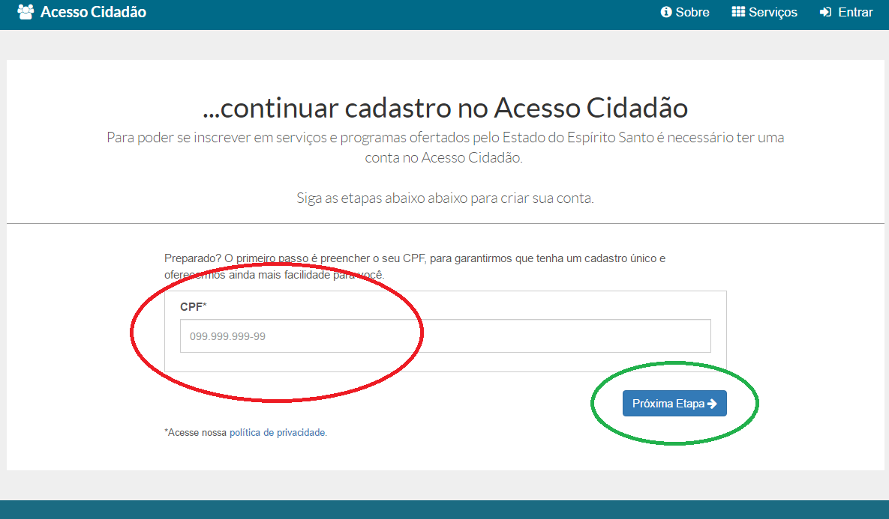
**Exceção:** Se seu CPF já estiver cadastrado você será levado para uma [tela informativa](https://acessocidadao.es.gov.br/Informacoes/CriarConta#) 
e deverá seguir as instruções apresentadas.  

2 - Ao verificar que o seu CPF não possui cadastro, você será levado para a tela seguinte e poderá decidir se quer começar o cadastro usando os dados de uma rede social ou 
se prefere fazer um novo cadastro completo.  
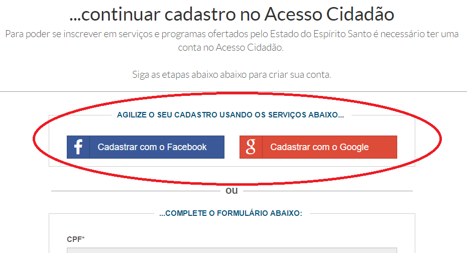
Caso use os dados de uma rede social o cadastro será agilizado. Caso opte por fazer o cadastro sem utilizar as redes sociais, você precisa fornecer um e-mail 
valido ao qual você tenha acesso e o cadastro só estará completo quando você validar esse e-mail.  

###### Cadastro Completo (sem usar rede social)  
3 - No cadastro normal você precisa preencher as informações abaixo e depois clicar em "Próxima Etapa":  

- CPF: Já vem preenchido e não pode ser alterado nessa etapa

- Nome completo: Campo obrigatório
- Senha: Campo obrigatório. Senha que vai ser usada para entrar no sistema
    - Deve conter no mínimo 8 caracteres
    - É sugerido que não seja utilizada uma senha classificada como fraca
- Confirme sua senha:  Campo obrigatório. Redigite a mesma senha usada no campo senha
- Data de nascimento: Campo obrigatório
- E-mail: Campo obrigatório. Esse e-mail será validado. Por favor só cadastre um e-mail ao qual você tem acesso
- Confirmar e-mail: Campo obrigatório. Redigite o mesmo e-mail usado no campo e-mail
- Nome da mãe: Campo obrigatório
- Nome do pai: Campo opcional  

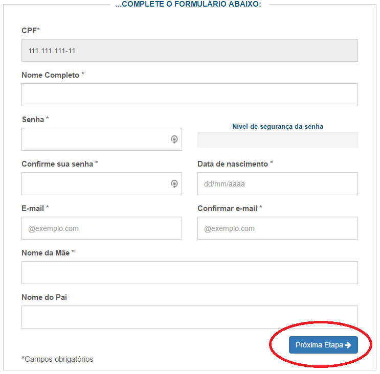  

4 - Ao clicar em "Próxima etapa", caso nenhum problema seja detectado, você será direcionado para a próxima tela.  
Como você fez um cadastro normal, você precisa validar o e-mail que usou para se cadastrar:  
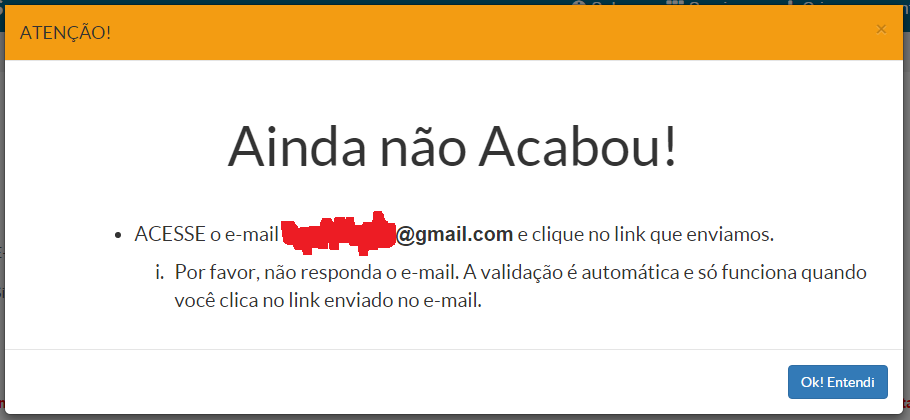  
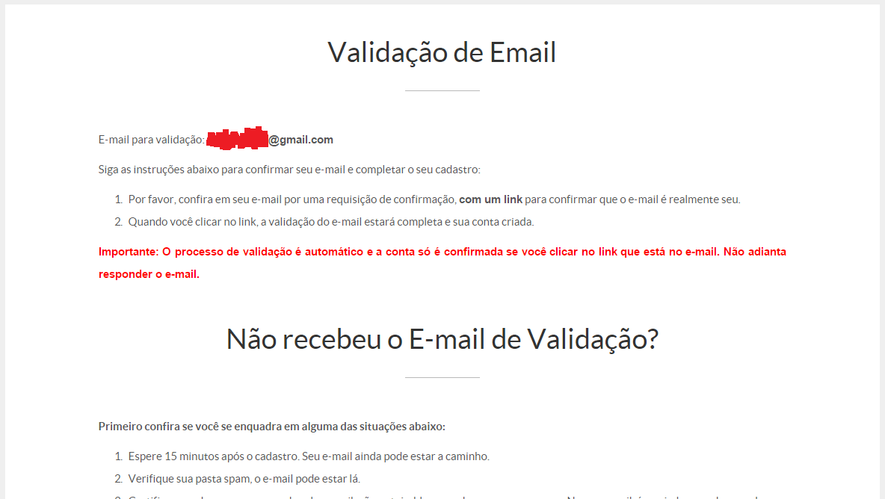  

5 - Seguindo as instruções exibidas na tela, entre no e-mail cadastrado e verifique se você recebeu um e-mail com o assunto: "Seu cadastro está quase completo".  
Caso não tenha recebido o e-mail verifique se você se enquadra em alguma das situações apresentadas e caso necessário siga as instruções para reenviar o e-mail:  
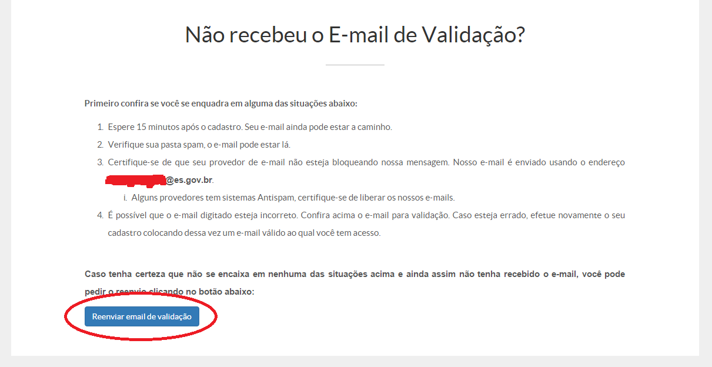  

6 - O email recebido deve ser similar à imagem abaixo. Para validar seu e-mail clique no link apresentado ou copie e cole o endereço no seu navegador da internet:  
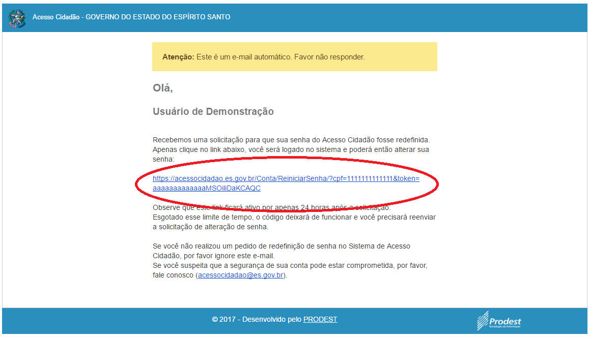  

7 - Com isso seu e-mail será validado e você estará automaticamente logado no sistema:  
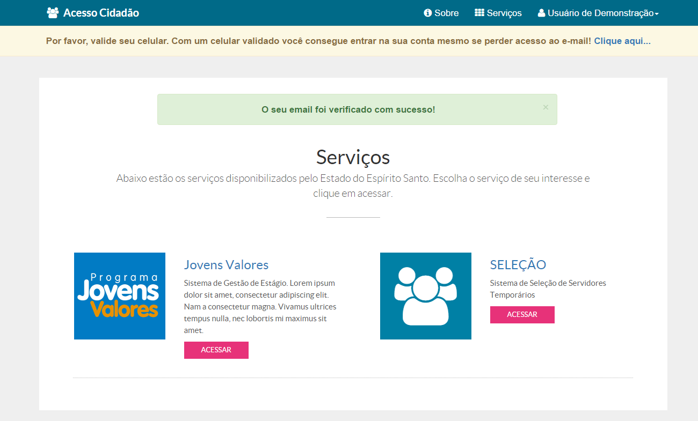  

###### Cadastro com Facebook  
  
8 - Ao clicar no botão "Cadastrar com o Facebook" você será levado à tela abaixo onde deverá clicar no botão "Ok":  
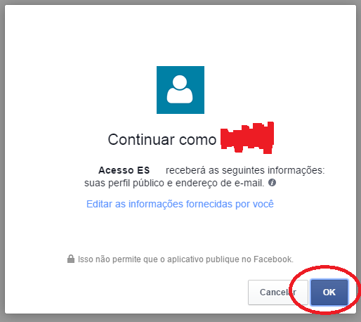  

9 - Ao aceitar a requisição você será redirecionado de volta para o cadastro. Só que dessa vez, alguns dados já virão preenchidos:  
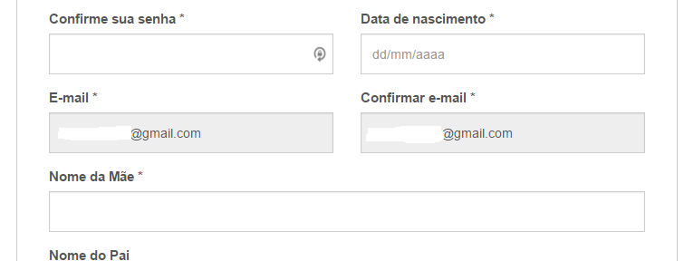  

10 - Termine de prencher os campos do cadastro e clique em "Próxima etapa". Caso nenhum problema seja detectado seu cadastro estará completo e você estará logado no sistema:  
  

###### Cadastro com Google  
  
11 - Ao clicar no botão "Cadastrar com o Google" você será levado à tela abaixo onde deverá clicar no botão "Permitir":  
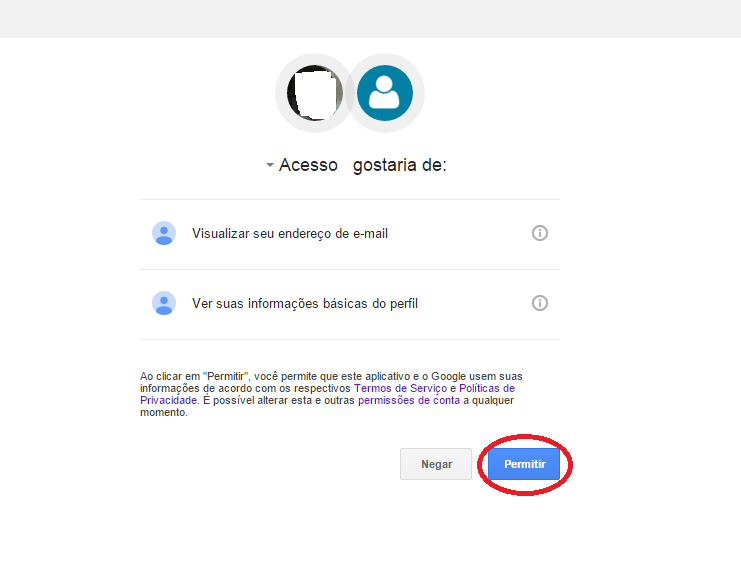  

12 - Ao aceitar a requisição você será redirecionado de volta para o cadastro. Só que dessa vez alguns dados já virão preenchidos:  
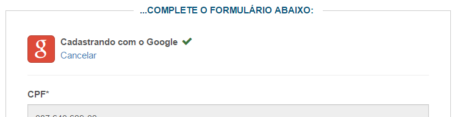  
  

13 - Termine de prencher os campos do cadastro e clique em "Próxima etapa". Caso nenhum problema seja detectado seu cadastro estará completo e você estará logado no sistema:  
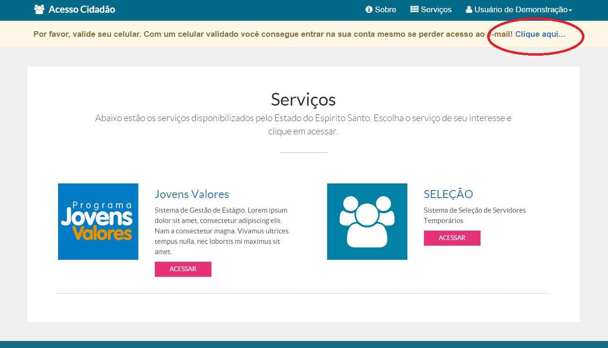

[CLIQUE AQUI](../_arquivos/CriarConta.pdf) Para obter o arquivo com essas instruções.