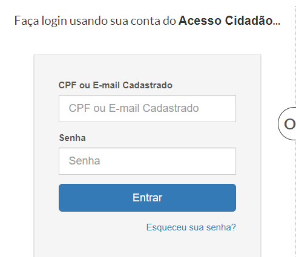
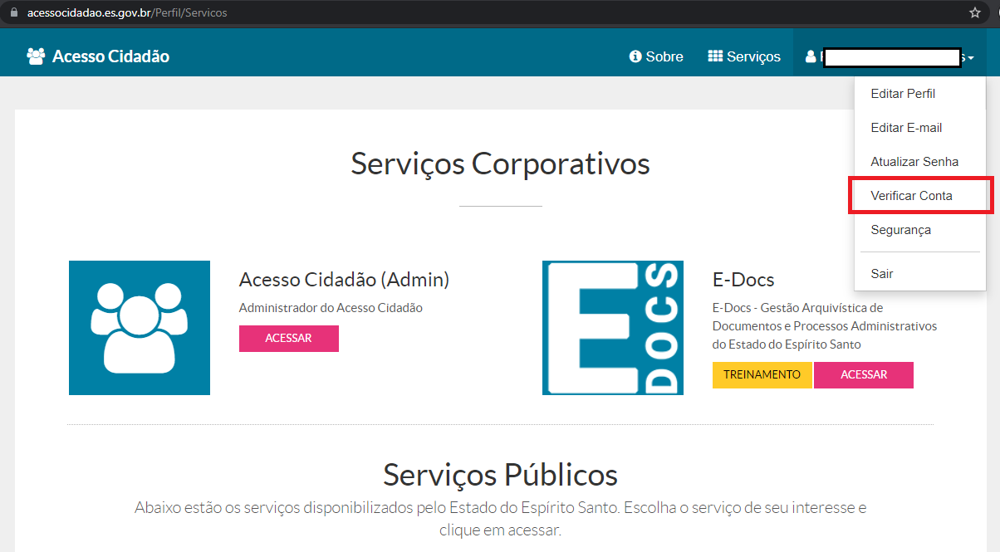
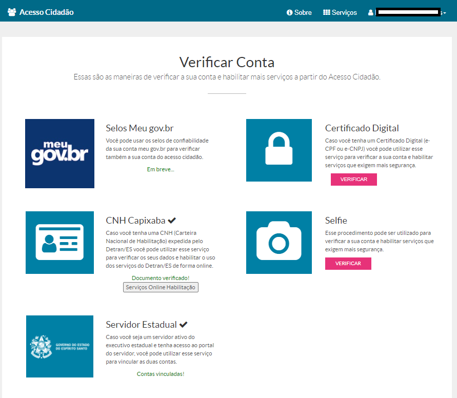
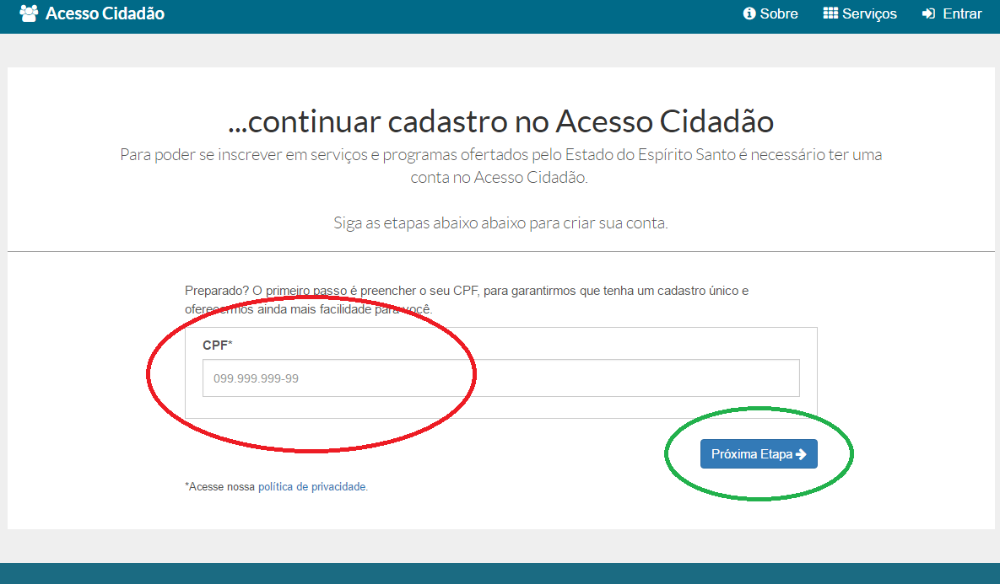
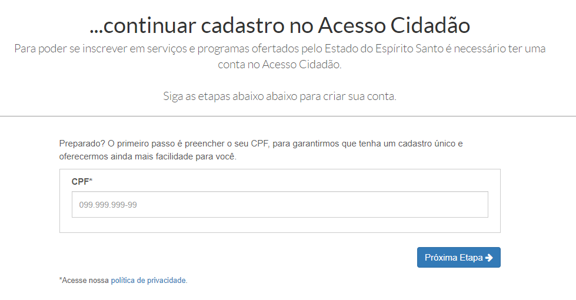

# Como Verificar uma Conta  

Mesmo após o cadastro em plataformas, como o Acesso Cidadão, é necessário fornecer meios de se comprovar a autenticidade das informações apresentadas. 
Isso proporciona mais segurança para o órgão que receberá suas informações e também para o cidadão/usuário do sistema, pois as verificações ajudam a manter 
afastadas pessoas má intencionadas mesmo que elas possuam sua senha.  

### Verificação de contas no Acesso Cidadão  

Para escolher o modo de verificação de sua conta no Acesso Cidadão acesse a plataforma e faça o login.
  

No menu superior, ao lado do seu nome clique na seta que apresenta as opções de sua conta e em seguida clique em Verificar Conta  
  

Nesta tela serão apresentadas as maneiras de se verificar a sua conta no Acesso Cidadão. Escolha a opção que preferir, clicando no botão **VERIFICAR** 
que existe para cada opção. No exemplo abaixo já existem duas verificações utilizadas; elas apresentam um :heavy_check_mark  
  

#### Opções de Verificação de Contas

##### Selos Meu gov.br  
1 - O portal [Meu gov.br](https://www.gov.br/pt-br) permite a verificação no Acesso Cidadão através dos selos de confiabilidade que aplica em sua plataforma.  
Os selos de confiabilidade se consistem na qualificação das contas por meio de dados autorizados pelo cidadão/usuário, a partir das bases oficiais de governo. 
Esses dados permitem a utilização de credenciais de acesso em sistemas internos e serviços providos ao cidadão.  

Os selos que atendem às verificações do Acesso Cidadão são:

- **Selo Internet Banking**: Validação do cadastro do cidadão por meio da plataforma de Internet Banking dos bancos conveniados. 
Para saber como adquirir este selo, [clique aqui](http://faq-login-unico.servicos.gov.br/en/latest/_perguntasdafaq/comoadquirirselointernetbanking.html)
- **Selo Validação Facial**: Validação do cadastro do cidadão por meio de biometria facial. A base utilizada para comparação é a da 
Carteira Nacional de Habilitação (Ministério da Infraestrutura / Denatran). 
Para saber como adquirir este selo, [clique aqui](http://faq-login-unico.servicos.gov.br/en/latest/_perguntasdafaq/comoadquirirvalidacaofacial.html)
- **Selo de Certificado Digital de Pessoa Física**: Validação do cadastro do cidadão por meio da utilização de certificado digital de pessoal física.
Para saber como adquirir este selo, [clique aqui](http://faq-login-unico.servicos.gov.br/en/latest/_perguntasdafaq/comoadquirircertificadodigitalpessoafisica.html)
- **Selo Internet Banking**: Validação do cadastro do cidadão por meio de biometria facial. A base utilizada para comparação 
é a da Justiça Eleitoral (Tribunal de Justiça Eleitoral). Para saber como adquirir este selo, [clique aqui](http://faq-login-unico.servicos.gov.br/en/latest/_perguntasdafaq/comoadquirirvalidacaofacial.html)

##### Certificado Digital  
2 - Caso você tenha um Certificado Digital (e-CPF ou e-CNPJ) você pode utilizar esse serviço para verificar a sua conta e habilitar serviços que exigem mais segurança.  

##### CNH Capixaba  
3 - Caso você tenha uma CNH (Carteira Nacional de Habilitação) expedida pelo Detran/ES você pode utilizar esse serviço para verificar os seus dados e 
habilitar o uso dos serviços do Detran/ES de forma online.  

###### Selfie  
4 - Esse procedimento pode ser utilizado para verificar a sua conta e habilitar serviços que exigem mais segurança. 

###### Servidor Estadual  
5 - Caso você seja um servidor ativo do executivo estadual e tenha acesso ao portal do servidor, você pode utilizar esse serviço para vincular as duas contas.  

1 - Primeiro você tem que digitar o seu CPF e clicar em Próxima Etapa para verificar se ele já está cadastrado no sistema.  

**Exceção:** Se seu CPF já estiver cadastrado você será levado para uma [tela informativa](https://acessocidadao.es.gov.br/Conta/VerificarCPF) 
e deverá seguir as instruções apresentadas.  

2 - Ao verificar que o seu CPF não possui cadastro, você será levado para a tela seguinte onde poderá preencher com o número do seu CPF e avançar para a próxima etapa  
  

[CLIQUE AQUI](../_arquivos/CriarConta.pdf) Para obter o arquivo com essas instruções.